### Sobre mí

Estudiante de Ingeniería en Computación en la FING (UdelaR) y egresado del Bachillerato en Informática de UTU. Empecé con desarrollo web (HTML, CSS, JavaScript y PHP con MySQL), después sumé Python para automatizaciones y C++ para programación de bajo nivel. También armo tiendas en Shopify con Liquid y domino herramientas de IA como Claude para desarrollar y automatizar. Tengo experiencia en soporte técnico y busco mi primer trabajo, remoto o en Uruguay.

### Lenguajes de programación

### Maquetación web

### Frameworks y herramientas

### Herramientas que domino

- **Claude**: desarrollo con agentes de código, automatización de tareas y revisión de código.
- **Google Labs**: Gemini, Flow y NotebookLM para investigar, generar imágenes y video, y resumir documentación.
- **Figma**: diseño de interfaces y prototipos antes de programarlos.
- **Shopify y Liquid**: edición de temas, secciones a medida y publicación con Shopify CLI.
- **Ollama**: modelos de IA corriendo en local.
- **Python**: scripts de automatización y bots.
- **MySQL**: diseño de tablas y consultas para backends en PHP.
- **Git y GitHub**: control de versiones y publicación de releases.

### Proyectos de aprendizaje

| Proyecto | Qué hace |
|---|---|
| [Reservini](https://github.com/UiUyHerrera/reservini) | App de reservas para negocios chicos, con agenda pública. |
| [ecommerce-rest-api](https://github.com/UiUyHerrera/ecommerce-rest-api) | API de tienda online con usuarios, productos y pedidos. |
| [discord-ticketing-bot](https://github.com/UiUyHerrera/discord-ticketing-bot) | Bot de tickets de soporte para Discord. |
| [mpeasy](https://github.com/UiUyHerrera/yt-mp4) | Extensión para descargar videos, con actualización automática. |

[LinkedIn](https://www.linkedin.com/in/luciano-herrera-b71212416/) · [bu3luciano@gmail.com](mailto:bu3luciano@gmail.com)
